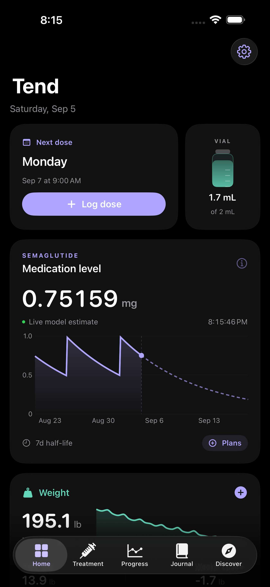
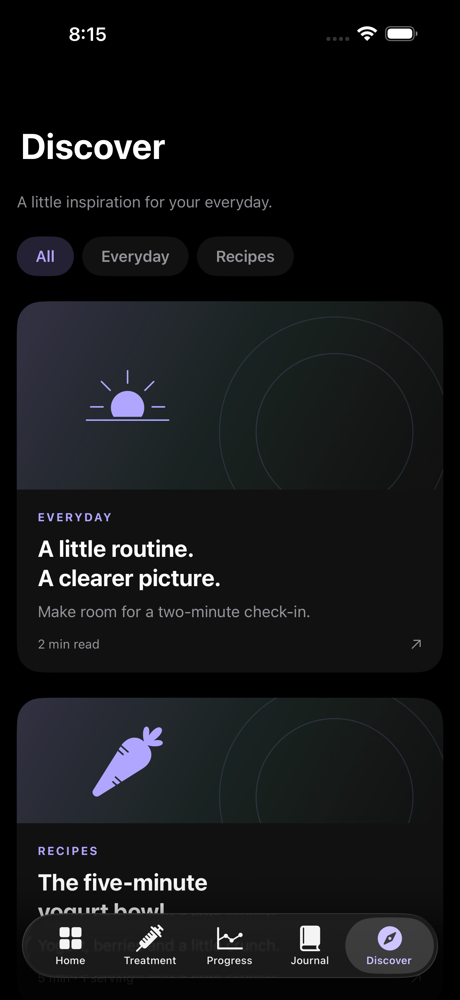
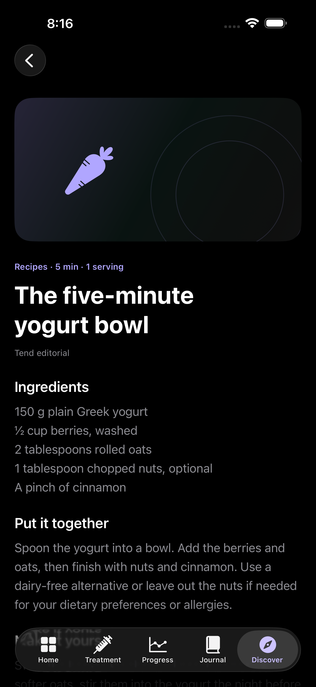

# Tend

A native, local-first iPhone journal for GLP-1 treatment. Built with SwiftUI and Swift Charts, with no sign-in, tracking SDKs or runtime dependencies.

**In development. TestFlight availability has not yet been verified.**

Track doses in mg, mL or explicitly confirmed U-100 syringe units; keep vial records; log weight and notes; review progress and estimated medication decay; record appetite and nausea; and choose weekly reminder days. Edit past records and distinguish future plans from actual entries. Discover includes bundled original articles and recipes. The assistant is a coming-soon preview, not a connected AI service.

Medication curves are simplified half-life estimates, not measured body or blood levels or dosing advice. Historical records retain their medication and concentration. Follow the instructions from your prescriber.

## Screenshots

Actual iPhone 17 Pro Max simulator captures using synthetic data.

<p></p>

## Run

Requires macOS, Xcode 26.2 or later and [XcodeGen](https://github.com/yonaskolb/XcodeGen).

```sh
xcodegen generate
open Still.xcodeproj
```

Choose the Still scheme and an iPhone simulator. The internal target and bundle identifier still use the earlier project name. For a device build, select your own development team.

Launch with `--demo` for synthetic, in-memory sample data. Demo mode never writes to your health journal or schedules notifications. `--uitest` selects a separate test journal when used without demo mode.

## Tests

```sh
swift test
xcodebuild -project Still.xcodeproj -scheme Still \
  -destination 'platform=iOS Simulator,name=Tend QA Pro Max' test \
  CODE_SIGNING_ALLOWED=NO
```

The Swift package tests cover calculations, validation, local calendar scheduling and file compatibility. UI tests exercise real simulator screens. See [architecture](docs/ARCHITECTURE.md), [user journeys](docs/USER-JOURNEYS.md) and [verification notes](docs/TESTING.md). Passing tests do not imply clinical validation or TestFlight publication.

## Privacy and storage

The health journal is stored in the app's Application Support directory using atomic file writes. No backend or telemetry is included. Device backups follow iOS settings. Discover content is bundled separately; no personal information is required to read it.

## Contributing

Keep changes focused on a user journey. Add a failing regression test before changing calculation or persistence behaviour, and include actual simulator screenshots for UI changes. Never commit personal health data, signing credentials or provisioning profiles. Use synthetic fixtures in screenshots.

## License

MIT. See [LICENSE](LICENSE).
